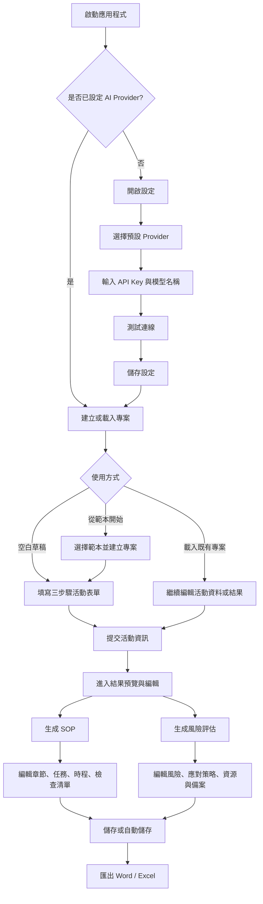
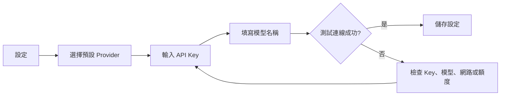
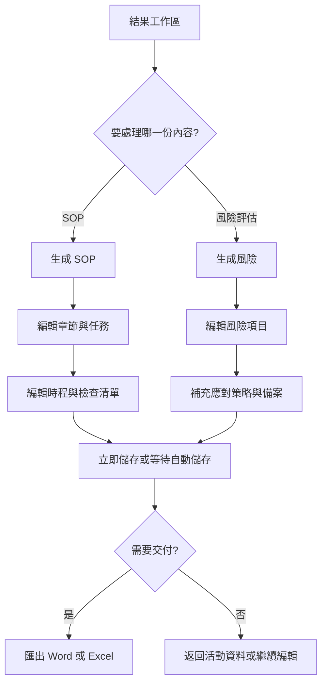

# 活動 SOP 與風險規劃生成器使用者操作手冊

活動 SOP 與風險規劃生成器是一套桌面應用程式，可協助活動企劃、行政、總務、專案管理與風險管理人員，將活動基本資料轉換為可編輯的 SOP 文件、時程、檢查清單與風險評估表，並匯出為 Word 或 Excel 檔案。

## 目錄

- [適用情境](#適用情境)
- [開始使用](#開始使用)
- [整體操作流程](#整體操作流程)
- [首次設定 AI 服務](#首次設定-ai-服務)
- [建立活動專案](#建立活動專案)
- [生成與編輯 SOP / 風險評估](#生成與編輯-sop--風險評估)
- [匯出文件](#匯出文件)
- [管理我的專案](#管理我的專案)
- [範本管理](#範本管理)
- [資料儲存與安全](#資料儲存與安全)
- [常見問題](#常見問題)
- [開發與驗證指令](#開發與驗證指令)

## 適用情境

本工具適合用於：

- 建立活動前置規劃、工作分工與執行 SOP。
- 依活動類型、規模、時間、地點與需求快速產出初稿。
- 盤點活動風險、應對方式、責任人、資源與備案。
- 將常用活動格式保存為範本，供下次活動快速套用。
- 匯出 Word SOP 或 Excel 工作表，提供團隊審閱與後續追蹤。

## 開始使用

### 方式一：使用已建置的桌面版

1. 開啟安裝版或 portable 免安裝版程式。
2. 第一次使用時，先進入右上角「設定」填入 AI Provider 與 API Key。
3. 回到「專案編輯」建立活動資料。

portable 版本會將資料寫在執行檔同層的 `data/` 資料夾。若將 portable 程式移到另一台電腦，API Key 需要重新輸入。

### 方式二：從原始碼啟動

```bash
npm install
npm run dev
```

開發模式會啟動 Vite 與 Electron。畫面主要入口包含「導航」、「我的專案」、「範本管理」與「設定」。

## 整體操作流程



## 首次設定 AI 服務

生成 SOP 與風險評估前，必須先設定至少一組 AI Provider。

1. 點選右上角「設定」。
2. 在「預設模型提供商」選擇 `OpenAI`、`Claude` 或 `OpenRouter`。
3. 在對應 Provider 區塊輸入 API Key。
4. 視需求調整「模型」欄位。
   - OpenAI / Claude：輸入模型名稱。
   - OpenRouter：使用 `provider/model` 格式，例如 `openai/gpt-4o`。
5. 點選「測試連線」，確認 Key 與模型可用。
6. 點選「儲存設定」。

API Key 只會儲存在 Electron 主程序的安全儲存中；畫面會以遮罩形式顯示已儲存的 Key。若要更換 Key，重新輸入後儲存即可；若要刪除，點選該 Provider 的「移除」。



## 建立活動專案

### 從空白草稿開始

1. 點選「導航」。
2. 選擇「建立新專案」，或在表單上點選「建立空白草稿」。
3. 依序完成三個步驟：
   - 活動基本資訊：活動名稱、類型、規模、開始日期、結束日期、地點。
   - 詳細規劃：預計人數、預算、活動描述。
   - 特殊需求與確認：補充限制、特殊需求或注意事項。
4. 點選「提交」。
5. 系統會進入「結果預覽與編輯」工作區。

未完成必填欄位時，系統會提示需修正的欄位，且無法進入後續步驟。

### 從範本開始

1. 在「活動資訊輸入表單」點選「從範本開始」。
2. 選擇要套用的範本。
3. 輸入新專案名稱。
4. 建立後可繼續修改表單內容。

### 自動儲存

只要表單已有內容，編輯後約 3 秒會自動儲存為本機草稿。右側「即時摘要」會顯示目前步驟、已填欄位、待修正欄位與儲存狀態。

## 生成與編輯 SOP / 風險評估

提交活動資料後，會進入結果工作區。此處可分別生成 SOP 與風險評估，也可以直接修改生成結果。

### 生成 SOP

1. 點選「生成 SOP」。
2. 等待 AI 回傳結果。
3. 切換到 `SOP` 分頁檢查內容。
4. 可編輯：
   - 章節名稱、章節說明、預估工時。
   - 任務名稱、說明、負責人、預估工時、截止日期、相依任務、任務狀態。
   - 時程日期、時間、里程碑與說明。
   - 檢查清單分類、項目與勾選狀態。
5. 可新增、刪除或上下移動章節、任務、時程與檢查項目。

若已存在 SOP，點選「重新生成 SOP」會提示確認。確認後會覆蓋目前 SOP 內容。

### 生成風險評估

1. 點選「生成風險」。
2. 切換到「風險評估」分頁檢查內容。
3. 可編輯：
   - 風險名稱、分類、說明。
   - 可能性、影響、負責人與狀態。
   - 應對方式、應對行動、應對時程。
   - 資源需求與應變備案。
4. 可新增、刪除或上下移動風險項目。

風險摘要會依目前項目重新計算總數與等級分布。若已存在風險評估，點選「重新生成風險」會提示確認並覆蓋目前內容。



## 匯出文件

在「結果預覽與編輯」工作區可匯出：

- `Word`：匯出 SOP 文件，副檔名為 `.docx`。
- `Excel`：匯出 SOP 工作表，若專案已有風險評估，也會一併納入 Excel 檔案，副檔名為 `.xlsx`。

操作步驟：

1. 確認已生成 SOP。
2. 點選 `Word` 或 `Excel`。
3. 選擇儲存位置與檔名。
4. 匯出完成後，使用 Word 或 Excel 開啟檔案檢查格式。

若尚未生成 SOP，匯出按鈕會停用或顯示目前沒有可匯出的內容。

## 管理我的專案

點選上方「我的專案」可管理所有本機專案。

可用功能包含：

- 搜尋專案名稱、地點或活動描述。
- 依狀態篩選：草稿、進行中、已完成。
- 依最近更新、名稱或狀態排序。
- 檢視活動資訊摘要、SOP 文件預覽與風險評估摘要。
- 載入專案繼續編輯。
- 複製專案作為新版本。
- 修改專案狀態。
- 匯出完整專案 JSON。
- 將專案儲存為範本。
- 刪除不再需要的專案。

建議在正式交付後，將專案狀態改為「已完成」，方便後續搜尋與篩選。

## 範本管理

範本可用來快速建立類似活動，例如年度會議、教育訓練、展覽、社群活動或內部活動。

### 使用範本建立專案

1. 點選「範本管理」。
2. 使用搜尋、類型篩選、活動類型篩選或排序找到範本。
3. 點選「使用範本」。
4. 輸入新專案名稱。
5. 建立後進入專案編輯畫面。

### 新增或編輯範本

1. 點選「新增範本」或範本列上的「編輯範本」。
2. 填寫範本名稱。
3. 選擇範本類型：
   - 完整專案。
   - SOP。
   - 風險評估。
4. 選擇適用活動類型。
5. 視需求勾選「設為預設範本」。
6. 編輯範本內容 JSON。
7. 點選「儲存範本」。

範本內容 JSON 可包含活動設定、SOP 範本與風險評估範本。若 JSON 格式錯誤，系統會阻止儲存並顯示錯誤訊息。

### 匯入、匯出與分享

- 匯入範本：選擇 `.json` 範本檔後匯入。
- 匯出範本：將範本保存為 `.json` 檔，方便備份或移交。
- 生成分享碼：產生可提供給其他人的範本分享內容。
- 設為預設：將常用範本標記為預設。
- 刪除範本：移除不再使用的範本。

## 資料儲存與安全

- 專案資料會儲存在本機應用資料中。
- 表單與結果工作區皆支援約 3 秒自動儲存。
- API Key 不會寫入 localStorage；僅透過 Electron 主程序安全保存。
- portable 版本會把應用資料放在執行檔同層的 `data/` 資料夾。
- portable 版本跨機器使用時，因 API Key 透過作業系統安全機制加密，需在新機器重新輸入。
- 不要將 API Key、個人資料庫、`node_modules/` 或建置產物提交到版本控制。

## 常見問題

### 為什麼不能按「下一步」？

目前步驟有必填欄位未完成，或日期、人數、預算格式不正確。請依欄位錯誤提示修正後再繼續。

### 為什麼無法生成 SOP 或風險評估？

請確認：

- 已完成並提交活動資料。
- 已在「設定」儲存可用的 AI Provider 與 API Key。
- API Key 測試連線成功。
- 網路連線正常。
- 模型名稱正確，且帳號仍有可用額度。

### 重新生成會發生什麼事？

重新生成 SOP 或風險評估會覆蓋目前對應內容。系統會先跳出確認視窗，取消後不會覆蓋。

### 編輯後需要手動儲存嗎？

系統會自動儲存，但重要修改完成後建議點選「立即儲存」，確認狀態顯示修改已儲存。

### 匯出 Excel 需要先生成風險評估嗎？

至少需要先生成 SOP 才能匯出 Excel。若已有風險評估，Excel 匯出時會一併納入風險內容。

### 如何備份專案？

到「我的專案」選擇專案後，點選「匯出專案」即可保存為 JSON 檔。

## 開發與驗證指令

以下指令供維護者或開發者使用：

```bash
npm install
npm run dev
npm run type-check
npm run lint
npm test
npm run test:ai
npm run test:ui
npm run build
npm run build:portable
```

主要目錄：

```text
electron/        Electron 主程序、preload 與 IPC
src/components/  React UI 元件
src/services/    商業邏輯、AI、文件、匯入匯出與儲存服務
src/store/       Zustand 狀態管理
src/types/       共用型別
src/utils/       共用工具
tests/           Node test 測試
templates/       可匯入的活動範本
public/          靜態資源
```
